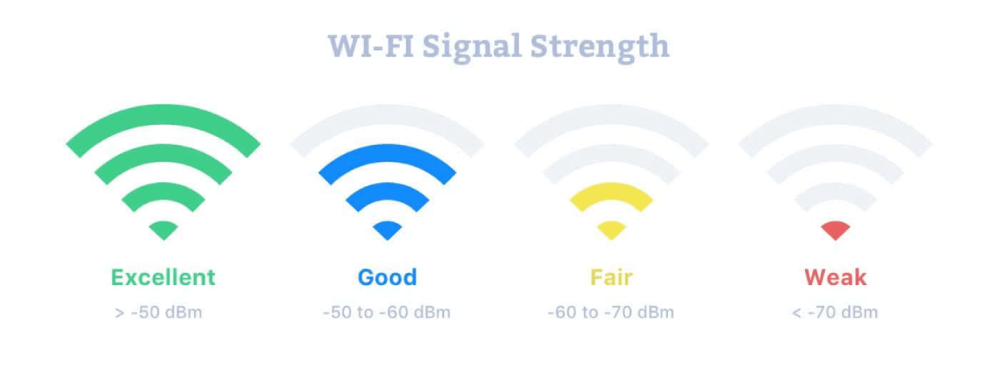

<div align="center" id="top"> 
  

  &#xa0;

  <!-- <a href="https://wifi_rssi_collection.netlify.app">Demo</a> -->
</div>

<h1 align="center">Wifi_rssi_collection</h1>

<p align="center">
  

  

  

  

  <!--  -->

  <!--  -->

  <!--  -->
</p>

<!-- Status -->

<!-- <h4 align="center"> 
	🚧  Wifi_rssi_collection 🚀 Under construction...  🚧
</h4> 

<hr> -->

<p align="center">
  <a href="#dart-about">About</a> &#xa0; | &#xa0; 
  <a href="#sparkles-features">Features</a> &#xa0; | &#xa0;
  <a href="#rocket-technologies">Technologies</a> &#xa0; | &#xa0;
  <a href="#white_check_mark-requirements">Requirements</a> &#xa0; | &#xa0;
  <a href="#checkered_flag-starting">Starting</a> &#xa0; | &#xa0;
  <a href="#memo-license">License</a> &#xa0; | &#xa0;
  <a href="blank">Author</a>
</p>

<br>

## :dart: About ##

As the package name suggets, this package is developed to source wifi data. Three different methods for sourcing data are provided under this package.

## :sparkles: Features ##

Feature 1: ROS support \
Feature 2: iwlist or scapy \
Feature 3: SQL data storage \
Feature 4: Error Info Logging  

## :rocket: Technologies ##

The following tools were used in this project:

- [Python 3](https://www.python.org/downloads/)
- [ROS melodic](http://wiki.ros.org/melodic)

## :white_check_mark: Requirements ##

Before stating, you need have ROS (refer to link above) and related Python packages installed

## :checkered_flag: Starting ##

```bash
```bash
# Clone this project
$ cd ~/catkin/src && git clone https://github.com/ZhenzhongLei/thesis.git

# Compile
$ cd ~/catkin && catkin_make

# Install dependencies
$ pip install numpy==1.19.2
$ ...

# Run the project
$ roslaunch wifi_rssi_collection collect.launch 

```

## :memo: License ##

To-do

## "memo" license ##

Developed by <a href="leizhenzhong15@gmail.com" target="_blank">{zhenzhong lei}</a>
&#xa0;

<a href="#top">Back to top</a>


